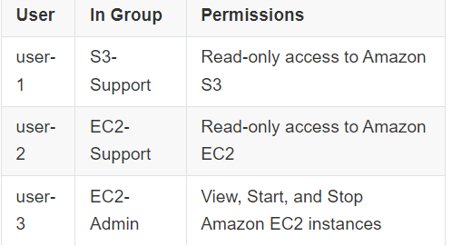

### Task 1: 

Explore the users and groups
In this task, you will explore the users and groups that have already been created for you in IAM.

First, note the Region that you are in; for example, N. Virginia. The Region is displayed in the upper-right corner of the console page.

You might need this information later in the lab.

Choose the Services menu, locate the Security, Identity, & Compliance services, and choose IAM.

In the navigation pane on the left, choose Users.

The following IAM users have been created for you:
``````
user-1
user-2
user-3
``````


Choose the name of 
``````
user-1
``````

This brings you to a summary page for user-1. The Permissions tab will be displayed.
Notice that user-1 does not have any permissions.
Choose the Groups tab.

Notice that user-1 also is not a member of any groups.

Choose the Security credentials tab.

Notice that user-1 is assigned a Console password. This allows the user to access the AWS Management Console.

In the navigation pane on the left, choose User groups.

The following groups have already been created for you:

```
EC2-Admin
EC2-Support
S3-Support
```
Choose the name of the 
``````
EC2-Support group
``````

This brings you to the summary page for the EC2-Support group.

Choose the Permissions tab.

This group has a managed policy called AmazonEC2ReadOnlyAccess associated with it. Managed policies are prebuilt policies (built either by AWS or by your administrators) that can be attached to IAM users and groups. When the policy is updated, the changes to the policy are immediately applied against all users and groups that are attached to the policy.

Under Policy Name, choose the link for the AmazonEC2ReadOnlyAccess policy.

Choose the
`````` 
JSON tab
``````

A policy defines what actions are allowed or denied for specific AWS resources. ***This policy is granting permission to List and Describe (view) information about Amazon Elastic Compute Cloud (Amazon EC2), Elastic Load Balancing, Amazon CloudWatch, and Amazon EC2 Auto Scaling. This ability to view resources, but not modify them, is ideal for assigning to a support role.***

Statements in an IAM policy have the following basic structure:

- **Effect:** says whether to Allow or Deny the permissions.
- **Action:** specifies the API calls that can be made against an AWS service (for example, cloudwatch:ListMetrics).
- **Resource:** defines the scope of entities covered by the policy rule (for example, a specific Amazon Simple Storage Service [Amazon S3] bucket or Amazon EC2 instance; an asterisk [ * ] means any resource).

```
{
    "Version": "2012-10-17",
    "Statement": [
        {
            "Effect": "Allow",
            "Action": "ec2:Describe*",
            "Resource": "*"
        },
        {
            "Effect": "Allow",
            "Action": "elasticloadbalancing:Describe*",
            "Resource": "*"
        },
        {
            "Effect": "Allow",
            "Action": [
                "cloudwatch:ListMetrics",
                "cloudwatch:GetMetricStatistics",
                "cloudwatch:Describe*"
            ],
            "Resource": "*"
        },
        {
            "Effect": "Allow",
            "Action": "autoscaling:Describe*",
            "Resource": "*"
        }
    ]
}
```

In the navigation pane on the left, 
``````
choose User groups
``````

Choose the name of the S3-Support group.

Choose the 
``````
Permissions tab
``````

The S3-Support group has the 
``````
AmazonS3ReadOnlyAccess policy 
``````
attached

Under Policy Name, choose the link for the 
``````
AmazonS3ReadOnlyAccess policy
``````

Choose the 
``````
JSON tab
``````

This policy has permissions to Get and List for all resources in Amazon S3.

```
{
    "Version": "2012-10-17",
    "Statement": [
        {
            "Effect": "Allow",
            "Action": [
                "s3:Get*",
                "s3:List*",
                "s3:Describe*",
                "s3-object-lambda:Get*",
                "s3-object-lambda:List*"
            ],
            "Resource": "*"
        }
    ]
}
```

In the navigation pane on the left, 
``````
choose User groups
``````

Choose the name of the EC2-Admin group.

Choose the Permissions tab.

***This group is different from the other two. Instead of a managed policy, the group has an inline policy, which is a policy assigned to just one user or group. Inline policies are typically used to apply permissions for specific situations.***

Under Policy Name, choose the name of the EC2-Admin-Policy policy.

Choose the JSON tab.
This policy grants permission to Describe information about Amazon EC2 instances, and also the ability to Start and Stop instances.
```
{
	"Version": "2012-10-17",
	"Statement": [
		{
			"Condition": {
				"ForAllValues:StringLikeIfExists": {
					"ec2:InstanceType": [
						"*.nano",
						"*.micro"
					]
				}
			},
			"Action": [
				"ec2:Describe*",
				"ec2:StartInstances",
				"ec2:StopInstances"
			],
			"Resource": [
				"*"
			],
			"Effect": "Allow"
		}
	]
}
```

At the bottom of the screen, choose Cancel to close the policy.

### Business scenario
For the remainder of this lab, you will work with these users and groups to enable permissions that support the following business scenario.

Your company is growing its use of AWS services, and is using many Amazon EC2 instances and Amazon S3 buckets. You want to give access to new staff depending upon their job function, as indicated in the following table:


