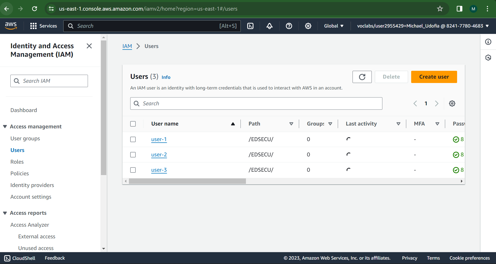

### Task 1: 

Explore the users and groups
In this task, you will explore the users and groups that have already been created for you in IAM.

First, note the Region that you are in; for example, N. Virginia. The Region is displayed in the upper-right corner of the console page.

You might need this information later in the lab.

Choose the Services menu, locate the Security, Identity, & Compliance services, and choose IAM.

In the navigation pane on the left, choose Users.

The following IAM users have been created for you:
``````
user-1
user-2
user-3
``````


Choose the name of 
``````
user-1
``````

This brings you to a summary page for user-1. The Permissions tab will be displayed.
Notice that user-1 does not have any permissions.
Choose the Groups tab.

Notice that user-1 also is not a member of any groups.

Choose the Security credentials tab.

Notice that user-1 is assigned a Console password. This allows the user to access the AWS Management Console.

In the navigation pane on the left, choose User groups.

The following groups have already been created for you:

```
EC2-Admin
EC2-Support
S3-Support
```